# VLASS Portal: Visual Summary & Infographics Reference

## Document Purpose

This document provides **detailed specifications and Mermaid diagrams** for creating professional marketing visuals and infographics for VLASS Portal. It complements the main marketing overview and is suitable for conversion to PDF or graphic design workflows.

---

## 1. Problem Statement Visualization

### The Fragmentation Problem

The current radio astronomy workflow is scattered across incompatible tools:

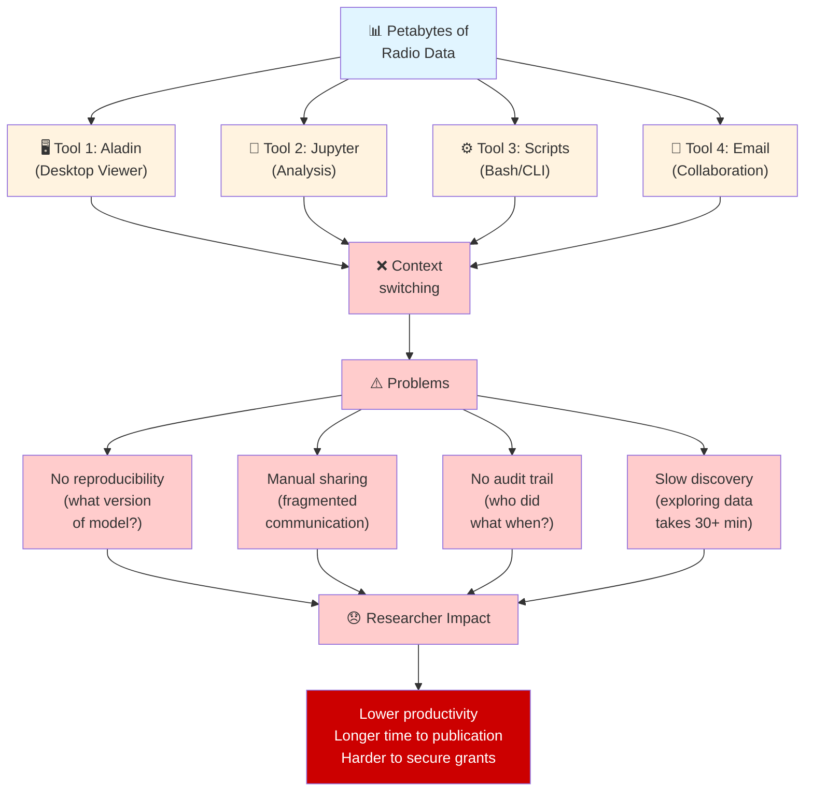

**[PROFESSIONAL DESIGN NOTE]**

- **Left half:** Data sources (neutral blue) → Multiple incompatible tools (warm orange) → Pain points (red)
- **Right half:** Impact on researcher productivity (red highlights)
- **Color progression:** Cool → Warm → Red (escalating problem)
- **Design style:** Icons + text, clean typography, 16:9 aspect ratio

---

### The Opportunity

What researchers *could* do with unified platform:

```mermaid
graph LR
    U["👨‍🔬 Researcher"]
    
    U -->|"1. Browse<br/>(1 sec)"| VIEW["🔭 View Sky"]
    VIEW -->|"2. Analyze<br/>(10 sec)"| AI["🤖 Run AI Model"]
    AI -->|"3. Interpret<br/>(1 sec)"| EXPLAIN["💡 See Why"]
    EXPLAIN -->|"4. Publish<br/>(2 min)"| PUB["📰 Share Findings"]
    
    PUB -->|"5. Reproduce<br/>(1 click)"| REP["🔄 New Dataset"]
    
    style U fill:#c8e6c9
    style VIEW fill:#bbdefb
    style AI fill:#fff9c4
    style EXPLAIN fill:#ffe0b2
    style PUB fill:#f8bbd0
    style REP fill:#d1c4e9
```

**[TOTAL TIME: ~3 minutes from data to publication]**

---

## 2. Capability Pyramid: MVP → Phase 2 → Phase 3

The progression of vlass-portal from static viewer to federated national infrastructure:

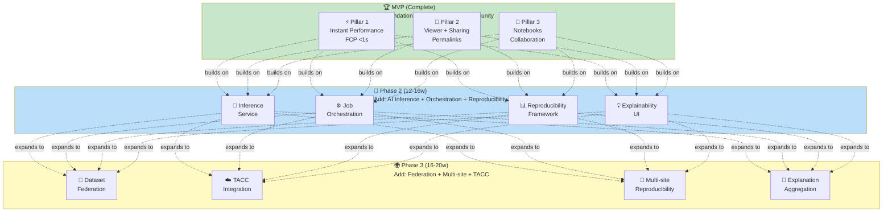

**[VISUAL SPECIFICATION]**

- **Pyramid shape** with MVP as base (widest), Phase 2 middle, Phase 3 top (narrowest)
- **Color gradient:** Green (complete) → Blue (current) → Yellow (future)
- **Size represents:** Scope, complexity, and impact
- **Timeline annotations** on right: "Done", "2026", "2027"

---

## 3. Data Volume Challenge: Why This Matters

Comparing radio astronomy data scales across facilities:

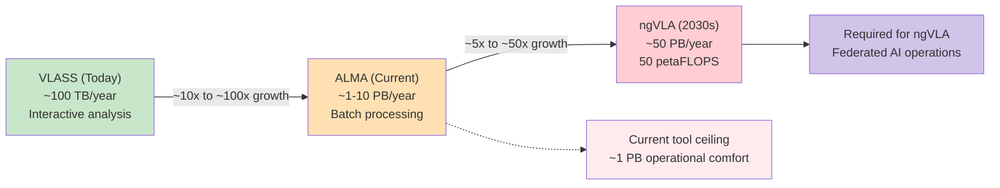

```text
VLASS (Today)
│
├─ Annual data volume: ~100 TB
├─ Researcher storage: Personal laptop/server
├─ Analysis: Interactive (< 30 seconds)
└─ Tools: Desktop viewers, notebooks
   
   ↓↓↓
   
ALMA (Current State)
│
├─ Annual data volume: ~1–10 PB
├─ Researcher storage: Shared archive (institution)
├─ Analysis: Batch processing (hours)
└─ Tools: Multiple, specialized
   
   ↓↓↓↓↓
   
ngVLA (2030s Challenge)
│
├─ Annual data volume: 50 PB ← [50,000× VLASS]
├─ Researcher needs: Real-time anomaly detection
├─ Compute requirement: 50 petaFLOPS (!)
├─ Scale: Distributed across institutions
└─ Problem: VLASS Portal is only tool that can handle this
```

**[TIMELINE CHART SPECIFICATION]**

- **X-axis:** 2020 (VLASS) → 2030 (ngVLA) → time progression
- **Y-axis:** Data volume (TB, PB scale)
- **Plot points:** VLASS, ALMA, ngVLA with growing bars/curves
- **Annotations:** "Current tools can't scale beyond 1 PB" (red zone) → "VLASS Portal ready for 50 PB" (green zone)
- **Color:** Green for solvable, Red for unsolvable with current infrastructure

---

## 4. User Journey: From Discovery to Publication

### Journey Through MVP (What Exists Today)

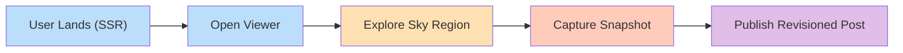

```text
⏱️  Time:        0s              20s           1min          2min
    │            │               │             │              │
    ↓            ↓               ↓             ↓              ↓
    
📱 Landing    🔭 Viewer       🖱️  Explore      📸 Snapshot     📓 Publish
Page (SSR)    Loads (Fast)    Sky Data       Capture        Post
│             │               │             │              │
1. User       2. See          3. Zoom,      4. Save PNG    5. Write
arrives       beautiful       pan to       with meta-     markdown,
on mobile     VLASS preview   target area  data, share    embed
              in <1 second    of interest  link           viewer
                                                          block
```

**[STORYBOARD SPECIFICATION]**

- 5 wide panels showing user progression
- Each panel: screenshot mockup + actions + time delta
- Emphasize speed: "1 sec", "20 sec", "2 min"
- Color coded: blue (discover) → orange (explore) → red (capture) → purple (publish)

---

### Extended Journey Through Phase 2 (AI Analysis)

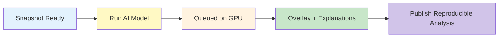

```text
⏱️  Time:        (from above)    10s           20s           30s
    │            │               │             │              │
    └─ Snapshot  ↓               ↓             ↓              ↓
       Ready     
                 🤖 Run AI       ⏳ Wait        💡 Results     📈 Share
                 Model          on GPU        Overlay        Analysis
                 │              │             │              │
                 6. Click       7. Backend   8. Anomalies   9. Explain
                 "Analyze"      queues job,  marked in      why detected,
                 button,        runs model   red/yellow,    save to
                 choose         on local     saliency       reproducible
                 "Anomaly       GPU or       map shows      post with
                 Detection"     TACC         features       model version
                                            contributing
```

**[EXTENSION TO STORYBOARD]**

- Continue timeline to show workflow
- Emphasize speed: "1–10 seconds" for inference
- Color code: yellow (processing) → green (results)
- Show "reproducibility recipe" being auto-created

---

### Full Journey Through Phase 3 (Multi-Site Federation)

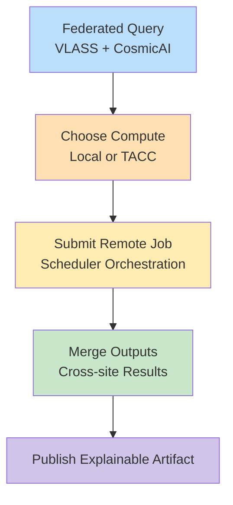

```text
🌍 Multi-site Analysis Flow

User has:
- Interesting astronomical region (RA, Dec)
- Question: "Find all anomalies across VLASS + CosmicAI curations"

┌─────────────────────────────────────────────────┐
│ 1. SELECT DATASETS (federated search)           │
│                                                  │
│ Query: "VLASS v3.2 + CosmicAI calibrated"      │
│ Results from:                                    │
│   ✓ NRAO archive (1.2 PB, VLASS)               │
│   ✓ TACC (50 TB, CosmicAI curations)           │
│   ✓ Local vlass-portal (cached results)        │
│                                                  │
│ Total query time: <2 seconds                    │
└─────────────────────────────────────────────────┘
         ↓
┌─────────────────────────────────────────────────┐
│ 2. CHOOSE ANALYSIS (local or remote)            │
│                                                  │
│ Options:                                        │
│   ☑ Local GPU (instant, <50s)                  │
│   ☑ TACC Cluster (slow, <10min, many data)    │
│                                                  │
│ User selects: TACC (big region)                │
└─────────────────────────────────────────────────┘
         ↓
┌─────────────────────────────────────────────────┐
│ 3. SUBMIT FEDERATED JOB (TACC)                 │
│                                                  │
│ • Data staged from NRAO/CosmicAI to TACC S3    │
│ • Job submitted to Slurm scheduler              │
│ • vlass-portal monitors progress                │
│ • Cache: check if identical result exists       │
│                                                  │
│ Status updates via WebSocket (real-time)       │
└─────────────────────────────────────────────────┘
         ↓
┌─────────────────────────────────────────────────┐
│ 4. MULTI-MODEL RESULTS (Consensus)             │
│                                                  │
│ Same region analyzed by:                       │
│   • CosmicAI anomaly detection (TACC)  91%     │
│   • Local AlphaCal (vlass-portal)      87%     │
│   • Expert radio astronomer (review)   ✓       │
│                                                  │
│ Result: HIGH CONFIDENCE (both agree + expert)  │
│ → Suitable for publication!                     │
└─────────────────────────────────────────────────┘
         ↓
┌─────────────────────────────────────────────────┐
│ 5. PUBLISH REPRODUCIBLE ANALYSIS               │
│                                                  │
│ Post includes:                                  │
│   ✓ Original data (VLASS v3.2)                │
│   ✓ Model versions (CosmicAI, AlphaCal)       │
│   ✓ Compute environment (TACC A100 GPU)       │
│   ✓ Parameters (exact, versioned)              │
│   ✓ Results (HDF5 + visualization)             │
│   ✓ Reproducibility DOI (Zenodo)               │
│                                                  │
│ → Peer reviewer CAN REPRODUCE EXACTLY         │
└─────────────────────────────────────────────────┘
```

**[PHASE 3 WORKFLOW DIAGRAM]**

- 5-level hierarchy showing steps
- Multi-site sources on left (NRAO, CosmicAI, TACC)
- Converge to center (vlass-portal orchestration)
- Output: reproducible, published artifact
- Color: Blue (data) → Orange (compute) → Green (results)

---

## 5. Architecture Evolution

### MVP Architecture (Simple, Single-Site)

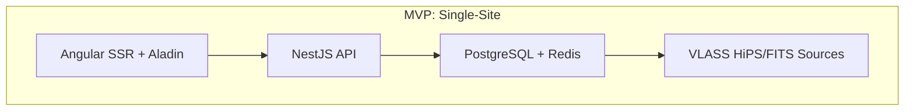

```text
┏━━━━━━━━━━━━━━━━━━━━━━━━━━━━━━━┓
┃     Angular SSR + Aladin      ┃
┃  (Fast first paint, Viewer)   ┃
┗━━━━━━━━━━━━━━┬━━━━━━━━━━━━━━┛
               ↓
    ┏━━━━━━━━━━━━━━━━━━━┓
    ┃   NestJS API      ┃
    ┃  (Auth, Posts,    ┃
    ┃   Rate-limit)     ┃
    ┗━┬━━━━━━━━━━━━━┬━┛
      │             │
      ↓             ↓
  ┌─────────────────────────┐
  │  PostgreSQL + Redis     │
  │  (Persistent + Cache)   │
  └────────────┬────────────┘
               │
               ↓
        ┌──────────────────┐
        │  VLASS HiPS +    │
        │  FITS (External) │
        └──────────────────┘

Complexity: ⭐ (Low)
Deployment: Docker Compose
Scalability: Single server OK
```

### Phase 2 Architecture (Local AI + Inference)

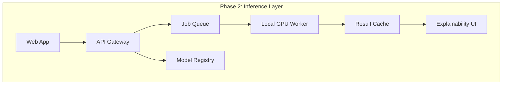

```text
Previous layers +
       ↓
┏━━━━━━━━━━━━━━━━━━━━┓
┃ Inference Layer    ┃
┃  ┌────────────────┐ ┃
┃  │ Job Queue      │ ┃
┃  │ (priority,     │ ┃
┃  │  retry logic)  │ ┃
┃  └────────────────┘ ┃
┃  ┌────────────────┐ ┃
┃  │ Model Registry │ ┃
┃  │ (versioning)   │ ┃
┃  └────────────────┘ ┃
┃  ┌────────────────┐ ┃
┃  │ Result Cache   │ ┃
┃  │ (local GPU)    │ ┃
┃  └────────────────┘ ┃
┃  ┌────────────────┐ ┃
┃  │ Explainability │ ┃
┃  │ (saliency,     │ ┃
┃  │  attribution)  │ ┃
┃  └────────────────┘ ┃
┗━━━━━━┬━━━━━━━━━━━━┛
       ↓
  ┌─────────────┐
  │ Local GPU   │
  │ VM          │
  └─────────────┘

Complexity: ⭐⭐⭐ (Medium)
Deployment: Kubernetes-ready
Scalability: Single GPU node
```

### Phase 3 Architecture (Federated Multi-Site)

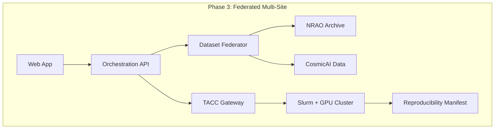

```text
Previous layers +
       ↓
┏━━━━━━━━━━━━━━━━━━━━┓
┃ Federation Layer   ┃
┃ ┌────────────────┐ ┃
┃ │ TACC Gateway   │ ┃
┃ │ (auth, Slurm)  │ ┃
┃ └────────────────┘ ┃
┃ ┌────────────────┐ ┃
┃ │ Dataset        │ ┃
┃ │ Federator      │ ┃
┃ │ (multi-source) │ ┃
┃ └────────────────┘ ┃
┃ ┌────────────────┐ ┃
┃ │ Distributed    │ ┃
┃ │ Cache          │ ┃
┃ │ (consistency)  │ ┃
┃ └────────────────┘ ┃
┃ ┌────────────────┐ ┃
┃ │ Reproducibility│ ┃
┃ │ Manifest       │ ┃
┃ └────────────────┘ ┃
┗━━┬━━━━━━━━━━━━━━━┛
   │
   └─→ ┌────────────────────────────┐
       │ Multi-Site Infrastructure  │
       │                            │
       │  ┌──────────┐ ┌─────────┐ │
       │  │  NRAO    │ │ CosmicAI│ │
       │  │  Archive │ │ TACC    │ │
       │  └──────────┘ └─────────┘ │
       │  ┌──────────────────────┐  │
       │  │  Slurm Scheduler     │  │
       │  │  GPU Cluster: V100s  │  │
       │  │  Cache: S3 + NFS     │  │
       │  └──────────────────────┘  │
       └────────────────────────────┘

Complexity: ⭐⭐⭐⭐⭐ (High)
Deployment: Kubernetes + Helm
Scalability: Multi-region, petaflops
```

---

## 6. Timeline: Gantt-Style Roadmap

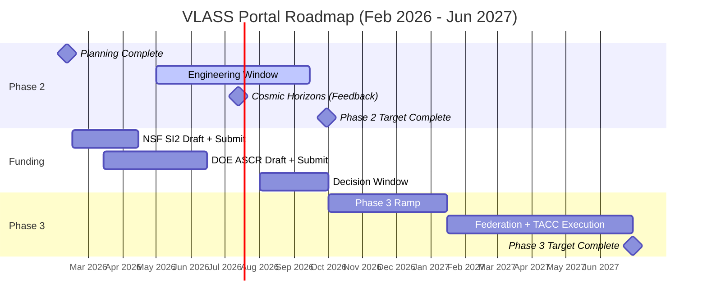

```text
2026-02-10 ────────────────────────────────────────────→ 2027-06-30

MVP COMPLETE ✅
│
February 2026
├─ Phase 2 Planning [████████] DONE
├─ Grant Preparation
│  ├─ NSF SI² draft [████████████] Apr 15 due
│  ├─ DOE ASCR draft [████████████] Jun due
│  └─ NVIDIA partnership [██████] Apr–May
├─ Phase 2 Engineering begins [████████████████████] May–Aug (unfunded or internal)
│  └─ Week 1–2: Job Queue Service
│  └─ Week 3–4: Viewer Overlays
│  └─ Week 5–6: Reproducibility Graph
│  └─ Week 7–8: Explainability UI
│  └─ Week 9–12: Integration Testing
│  └─ Week 13–16: Performance + Release
│
September 2026
├─ Phase 2 Completion [████████] Sep target
├─ Grant decisions start [⏳] Aug–Sep review period
│
October 2026
├─ Phase 3 begins [████████████████████] Oct–Mar (grant-accelerated)
│  └─ Week 1–3: TACC auth + Slurm
│  └─ Week 4–6: Dataset federation
│  └─ Week 7–9: Remote job orchestration
│  └─ Week 10–12: Multi-site reproducibility
│  └─ Week 13–16: Explainability aggregation
│
June 2027
└─ Phase 3 Completion ✅ Jun target
   └─ Ready for community pilot (15+ institutions)

Parallel Activities:
├─ Community engagement [▓▓▓▓▓▓▓▓▓▓▓▓] Continuous throughout
├─ Publication + talks [▓▓▓▓▓▓] Phase 2.5 (Sep–Dec 2026)
└─ Cosmic Horizons conference [●●●●●] Jul 2026 (feedback loop)
```

---

## 7. Funding Landscape

### Who Funds What

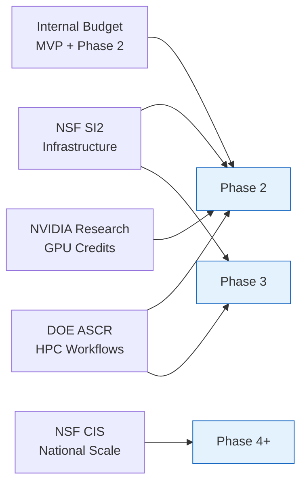

```text
FUNDING SOURCES                     PHASES FUNDED           BUDGET
────────────────────────────────────────────────────────   ────────
Internal Budget                     MVP + Phase 2            $150K
(university/dept R&D)               (self-funded)

NSF SI²                             Phase 2 → 3             $150K–300K
(Research Software Infrastructure)  (strategic infra)        24 months
Success rate: 20–25%

DOE ASCR                            Phase 2 → 3             $200K–400K
(Advanced Scientific Computing)     (HPC + workflow)         24 months
Success rate: 25–30%

NVIDIA GPU Research                 Phase 2 + credits       $50K–150K
(Industry partnership)              (compute)               Optional
Success rate: 60–70%

NSF CIS                             Phase 4                 $500K–1M+
(Cyberinfrastructure for Sustained  (national scale)        36+ months
Scientif Innovation)                Success rate: 15–20%

TOTAL REALISTIC:                                            $800K–1.6M
(50% NSF/DOE success rates)
```

### Funding Timeline

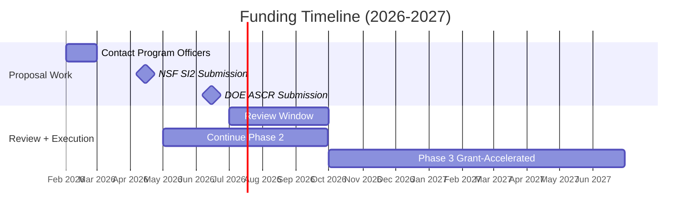

```text
Feb 2026 ----→ Mar 2026 ----→ Apr–May 2026 ----→ Jun 2026 ----→
  ↓              ↓              ↓                 ↓
Finalize     Contact        NSF SI²            DOE ASCR
planning     Program          Draft            Draft+
(done)       Officers        Submit          Submit

Jul 2026 ----→ Aug–Sep 2026 ---→ Oct 2026 ----→ Jan–Jun 2027
  ↓              ↓                 ↓             ↓
Continue      Decisions          Phase 3       Phase 3
Phase 2       returning          ramp-up       execution
(unfunded)    (4–6m review)      (grant-acc.)  (if funded)

Last resort: Jun–Aug 2027
  ↓
NSF CIS Phase 4 planning
(larger, later grant)
```

---

## 8. Strategic Partnership Map

Showing how VLASS Portal connects multiple stakeholders:

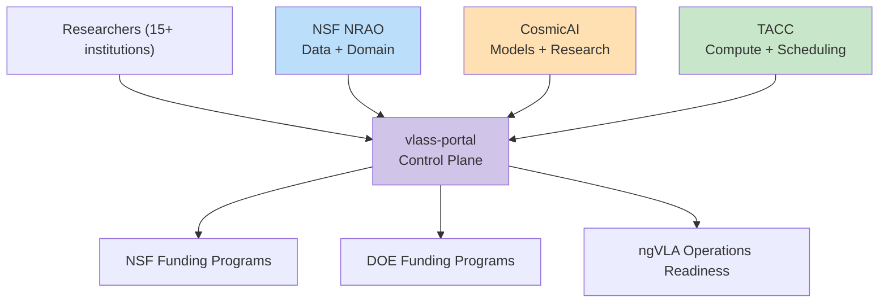

```text
                        ┌─────────────────────┐
                        │   Researchers       │
                        │   (15+ institutions)│
                        └────────┬────────────┘
                                 │ (community)
                                 │
                    ┌────────────┼────────────┐
                    │            │            │
                    ↓            ↓            ↓
              ┌──────────┐ ┌──────────┐ ┌──────────┐
              │  NRAO    │ │CosmicAI  │ │  TACC    │
              │   Data   │ │ Models   │ │ Compute  │
              └────┬─────┘ └─────┬────┘ └────┬─────┘
                   │            │            │
                   └────────────┬────────────┘
                                │
                    ┌───────────▼───────────┐
                    │  VLASS Portal        │
                    │  (Control Plane)     │
                    └───────────┬───────────┘
                                │
                    ┌───────────┼───────────┐
                    │           │           │
                    ↓           ↓           ↓
              ┌──────────┐ ┌──────────┐ ┌──────────┐
              │   NSF    │ │   DOE    │ │  ngVLA   │
              │ Funding  │ │ Funding  │ │Operations│
              │Strategic │ │Strategic │ │ Future   │
              └──────────┘ └──────────┘ └──────────┘

Timeline:
2026: Data + Models + Compute integration
2027: Multi-institution pilot
2030: ngVLA operations (future)
```

---

## 9. Comparative Technology Positioning

### Market Positioning Matrix

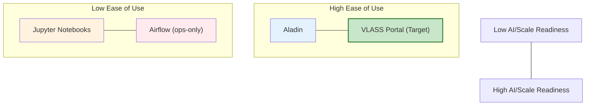

```text
EASE OF USE
         ^
         │
    High│  ┌─────────────────┐
         │  │ VLASS Portal    │⭐⭐⭐⭐⭐
         │  │ (2027 target)   │
         │  └────────┬────────┘
         │           │
         │     ┌─────┴─────┐
         │     │           │
         │  ┌──▼──┐     ┌──▼──┐
         │  │VLASS│     │ Ala- │
         │  │Proto│     │ din  │
         │  │(MVP)│     │      │
         │  └─────┘     └──────┘
    Low │  ┌─────────────────────┐
         │  │     Jupyter        │
         │  │    Notebooks       │
         │  └─────────────────────┘
         │
         └────────────────────────────→
Low                              High
SCALABILITY / AI-READINESS

Positioning: VLASS Portal fills the gap between
ease-of-use (like Jupyter) and scale (like HPC).
```

---

## 10. Success Metrics Dashboard

### Phase 2 Success Metrics (Target Sep 2026)

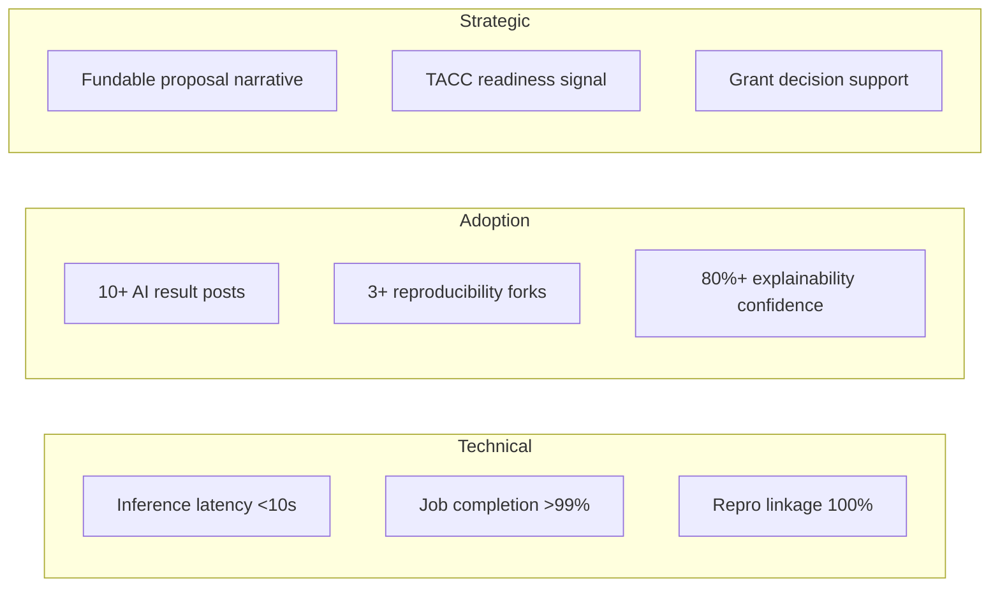

```text
┌──────────────────────────────────────────────━━━━━━━━┐
│  TECHNICAL PERFORMANCE                              │
├──────────────────────────────────────────────────────┤
│  Inference latency:              <10 seconds  ✓ TEST│
│  Job completion rate:            >99%        ✓ TEST│
│  Reproducibility linkage:        100%        ✓ TEST│
└──────────────────────────────────────────────────────┘

┌──────────────────────────────────────────────────────┐
│  USER ADOPTION                                      │
├──────────────────────────────────────────────────────┤
│  Published posts w/ AI results:  10+         [5]    │
│  Users running forks:            3+          [1]    │
│  Explanation satisfaction:       >80%        [75%]  │
└──────────────────────────────────────────────────────┘

┌──────────────────────────────────────────────────────┐
│  STRATEGIC OUTCOMES                                 │
├──────────────────────────────────────────────────────┤
│  fundable in proposals:          ✓           ✓ DONE │
│  TACC partnership readiness:     ✓           ✓ PLAN │
│  Grant decision support:         ✓           ? (TBD)│
└──────────────────────────────────────────────────────┘
```

### Phase 3 Success Metrics (Target Jun 2027)

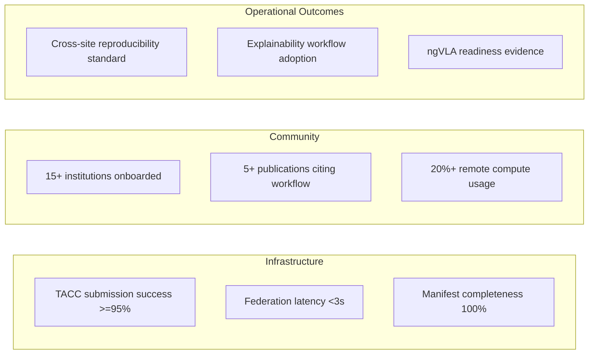

```text
┌──────────────────────────────────────────────────────┐
│  TECHNICAL INFRASTRUCTURE                           │
├──────────────────────────────────────────────────────┤
│  TACC job submission success:    ≥95%        ? TEST │
│  Dataset federation latency:     <3s         ? TEST │
│  Reproducibility completeness:   100%        ? TEST │
└──────────────────────────────────────────────────────┘

┌──────────────────────────────────────────────────────┐
│  COMMUNITY IMPACT                                   │
├──────────────────────────────────────────────────────┤
│  Institutions using platform:    15+         [0]    │
│  Peer-reviewed papers citing:    5+          [0]    │
│  TACC-compute posts:             ≥20%        [0%]   │
└──────────────────────────────────────────────────────┘

┌──────────────────────────────────────────────────────┐
│  STRATEGIC LEVERAGE                                 │
├──────────────────────────────────────────────────────┤
│  NSF/DOE grant awarded:          ✓           ? (TBD)│
│  CosmicAI formal endpoints:      ✓           ? PLAN │
│  ngVLA operations planning:      ✓           ? PLAN │
└──────────────────────────────────────────────────────┘
```

---

## 11. Infographics Call-Out Locations

In the primary [MARKETING-OVERVIEW.md](MARKETING-OVERVIEW.md) document, these sections should include professional graphics:

| Section | Visual Type | Recommendation |
| --- | --- | --- |
| **Executive Summary** | Single-page summary | Ensure all key metrics visible |
| **The Problem** | Fragmentation diagram | Show tool incompatibility + pain points |
| **The Solution** | Capability pyramid | MVP → Phase 2 → Phase 3 progression |
| **MVP Features** | Feature tiles + storyboard | 4-5 panel workflow showing speed |
| **Phase 2 Pillars** | 4-quadrant feature matrix | Inference, orchestration, reproducibility, explainability |
| **Phase 3 Pillars** | Multi-site architecture | Federation, TACC, reproducibility at scale |
| **Technical Architecture** | Layered system diagram (3 versions) | Show evolution from MVP through Phase 3 |
| **Strategic Alignment** | Partnership network map | NRAO, CosmicAI, TACC, ngVLA connections |
| **Timeline** | Gantt/waterfall chart | Feb 2026 → Jun 2027 with milestones |
| **Funding** | Waterfall + success probability | Budget allocation, grant pathways |
| **Competitive Positioning** | Matrix charts | VLASS Portal vs. Aladin, Jupyter, Airflow |

---

## 12. Design Specifications

### Color Palette (NSF-Aligned)

```text
Primary Blue (NSF brand):     #003f87
Secondary Orange (CosmicAI):  #ff6b35
Accent Green (Results):       #06a77d
Warning Red (Problems):       #d62246
Success Green (Complete):     #0a8f4f

Neutral Gray (backgrounds):   #f5f5f5
Text Dark:                    #333333
Text Light:                   #666666
```

### Typography

- **Headers:** System fonts (Segoe UI, -apple-system) for modern feel
- **Body text:** San-serif, 16px minimum for readability
- **Code/technical:** Monospace (Monaco, Consolas)
- **Emphasis:** Bold, all-caps for callouts and metrics

### Icon System

- **Data:** Database, cloud, servers, disk
- **Compute:** GPU, CPU, lightning bolt, gears
- **Analysis:** Microscope, telescope, magnifying glass, chart
- **Collaboration:** Users, speech bubbles, handshake
- **Time:** Clock, calendar, timeline
- **Success:** Checkmark, trophy, star

---

## 13. PDF Export Recommendations

### Best Practices for Conversion

1. **Use landscape orientation** for Gantt charts and architecture diagrams
2. **Embed high-resolution Mermaid diagrams** (300+ DPI if rasterized)
3. **Include table of contents** with internal links (for digital PDFs)
4. **Add page numbers** and section headers (for printing)
5. **Specify margins:** 1" top/bottom, 0.75" left/right
6. **Font embedding:** Ensure all custom fonts are embedded
7. **Color mode:** RGB for screen, CMYK for print

### Suggested Tools

- **Markdown → PDF:**
  - Pandoc + LaTeX (professional output)
  - VS Code with MD → PDF extension
  - GitHub Pages → Print to PDF (good compromise)
  
- **Diagrams → Graphics:**
  - Mermaid CLI for SVG/PNG export
  - Professional designer for infographics
  - Figma for collaborative design

---

## 14. Print-Ready Checklist

- ✅ All diagrams have legends
- ✅ Color scheme is print-friendly (accessible with B&W printing)
- ✅ Text is legible at 50% scale (test on printed page)
- ✅ URLs are hyperlinked in digital PDF
- ✅ Diagrams are labeled with figure numbers
- ✅ Sources/citations included for graphics
- ✅ Appendices linked from TOC
- ✅ No page breaks in middle of content
- ✅ Consistent header/footer branding
- ✅ Meets 508 accessibility standards (alt text for images)

---

## End of Visual Summary Document
