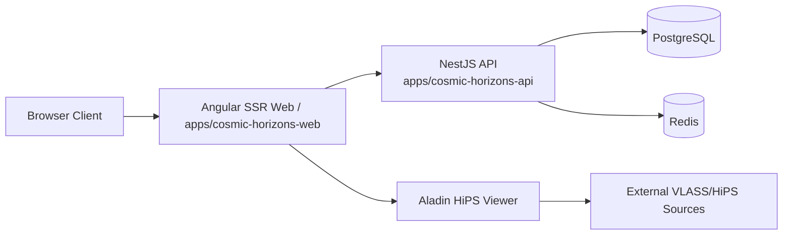
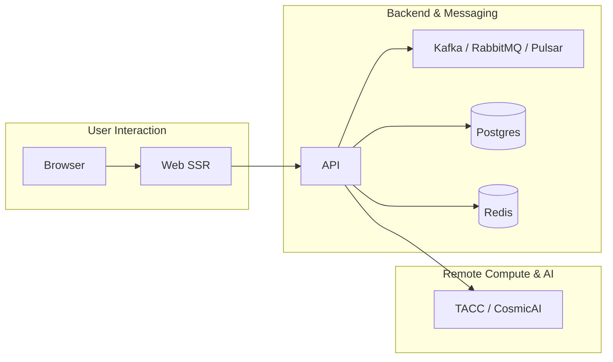

# Architecture (MVP)

Status date: 2026-02-07

## Documentation Categories

To help navigate this folder, the architecture documentation is grouped into the following high‑level categories.  Each category contains one or more markdown files focused on a particular aspect of the system.

1. **Core Application** – general overview and boundary definitions.
   - `ARCHITECTURE.md` (this file)
   - `EVENT-STREAMING-TOPOLOGY.md` (message flow diagrams)
   - `EVENT-SCHEMA-DEFINITIONS.md` (data contracts)

2. **Message Brokers & Streaming** – detailed container descriptions and evaluation results.
   - `../brokers/MESSAGE-BROKERS.md` (combined broker reference)
   - `../brokers/BROKER-COMPARISON-STRATEGY.md`
   - `../brokers/NGVLA-TRI-BROKER-REFERENCE-ARCHITECTURE.md`
   - `../brokers/PULSAR-EVALUATION-RESULTS.md`
   - `../brokers/ADR-EVENT-STREAMING.md` (architecture decision record)

3. **Integration & Overlay** – how the system connects to external services and AI platforms.
   - `../integration/COSMICAI-INTEGRATION-OVERLAY.md`

4. **Governance & Audit** – sitewide rules and auditing strategies.
   - `../governance/AUDIT-STRATEGY-SITEWIDE.md`

This categorical view helps readers quickly find documents relevant to their topic of interest.  Additional files may be added to these groups as the architecture evolves.

Canonical scope is defined by:

- `documentation/product/PRODUCT-CHARTER.md`

- `SCOPE-LOCK.md`

Affiliation note:

- This architecture describes an independent project that consumes public VLASS data.

- It is not an official system owned or operated by VLA/NRAO.

**Related Documentation**:

- ngVLA tri-broker operating pattern: [NGVLA-TRI-BROKER-REFERENCE-ARCHITECTURE.md](../brokers/NGVLA-TRI-BROKER-REFERENCE-ARCHITECTURE.md)

- CosmicAI docking and AI control-plane integration: [COSMICAI-INTEGRATION-OVERLAY.md](COSMICAI-INTEGRATION-OVERLAY.md)

## Components

- Frontend: `apps/cosmic-horizons-web` (Angular SSR)

- Backend: `apps/cosmic-horizons-api` (NestJS + Postgres/Redis)

- Event streaming and message brokers – deployed as containers for Kafka, RabbitMQ or Pulsar depending on workload.  See the dedicated documents:
  - [Messaging Brokers](../brokers/MESSAGE-BROKERS.md)

- Remote Compute Gateway (Phase 4): `JobsModule` integration with TACC/CosmicAI exascale compute fabric.

- Shared models: `libs/shared/models`

## Remote Compute & AI Integration (Phase 4)

The Cosmic Horizon serves as the **AI Control Plane** for autonomous agents developed by the NSF-Simons CosmicAI initiative.

- **Frontend Job Console**: Enterprise-grade steering interface for monitoring AlphaCal and Radio Image Reconstruction performance.
- **Backend Orchestration**: `TaccIntegrationService` manages job submission, status polling, and result retrieval from TACC resources.
- **Explainability**: Integration of agent-generated Science Ready Data Products (SRDPs) into Aladin snapshots for auditable results.





Frontend runtime note:

- Mode A viewer includes short-lived client-side HiPS tile prefetch/cache (window-scoped, TTL/LRU bounded) for UX performance only.

## Event Streaming & Messaging

The backend ecosystem relies on a pluggable event streaming layer. During development the tri-broker pattern is used to evaluate performance and protocol requirements, with Kafka as the primary high-throughput engine, RabbitMQ for AMQP-legacy compatibility, and Pulsar for multi-tenant, storage-decoupled pipelines.  The [NGVLA-TRI-BROKER-REFERENCE-ARCHITECTURE.md](../brokers/NGVLA-TRI-BROKER-REFERENCE-ARCHITECTURE.md) document expands on this operating pattern.

```mermaid
flowchart LR
    subgraph BrokerOptions["Messaging Brokers"]
        K["Kafka Cluster (see brokers)"]
        R["RabbitMQ Cluster (see brokers)"]
        P["Pulsar Cluster (see brokers)"]
    end
    A[NestJS API] -->|publish/consume| K
    A -->|publish/consume| R
    A -->|publish/consume| P
    subgraph CrossSite["Cross-Site Replication"]
        K --> K2[Kafka@SiteB]
        P --> P2[Pulsar@SiteB]
    end
```

Typical performance targets driving broker selection:

| Broker | Role | Throughput | Latency | Retention | Notes |
|--------|------|------------|---------|-----------|-------|
| Kafka | Telemetry, status, high-volume streams | up to 8 GB/s cluster-wide | <100 ms | days–weeks | Backbone for ngVLA data ingress |
| RabbitMQ | Control messages, job dispatch, AMQP interoperability | 100 k msgs/sec per node | <500 ms | minutes–hours | Useful for heterogeneous clients |
| Pulsar | Multi-tenant science pipelines, serverless compute | 20 GB/s ingest | sub-100 ms | months with BookKeeper | Schema registry & functions |

> The ngVLA is expected to generate around 240 PB/year.  Event brokers must sustain tens of millions of messages per second with cross-site replication, hence the emphasis on horizontal scaling and tiered archiving.

The choice of broker is abstracted by a messaging facade in the backend; modules can be configured at startup to bind to any supported system.

## Boundaries

- Browser does not directly own policy decisions.

- NestJS enforces auth, RBAC, auditing, and rate limits.

- Viewer is Mode A only (Aladin) for MVP.

- SSR is the user entry path; API remains the policy and data control plane.

## Data Policy

- Public VLASS usage only.

- FITS is link-out only.

- No mirror-like proxy in MVP.

- Viewer tile prefetch is transient and non-mirroring (not persisted, bounded by policy).

## Rust and Go Decision

- Go microservice is removed from MVP.

- Rust rendering is optional and deferred.

- Because Mode B is deferred, no heavy rendering tier is required for MVP success.

- Re-introduce a render service only if one of these triggers occurs:
  1. Snapshot generation cannot meet quality/performance targets in Node/client path.

  2. SSR preview generation becomes CPU-bound in production.

  3. v2 Mode B is approved.

Mode B planning overview (timing, feasibility, permission assumptions):

- Mode B documentation is deferred; publish a dedicated architecture addendum
  if Mode B is reactivated.

---

_Cosmic Horizon Development - (c) 2026 Jeffrey Sanford. All rights reserved._

---

_Independent portal using public VLASS data; not affiliated with VLA/NRAO._
