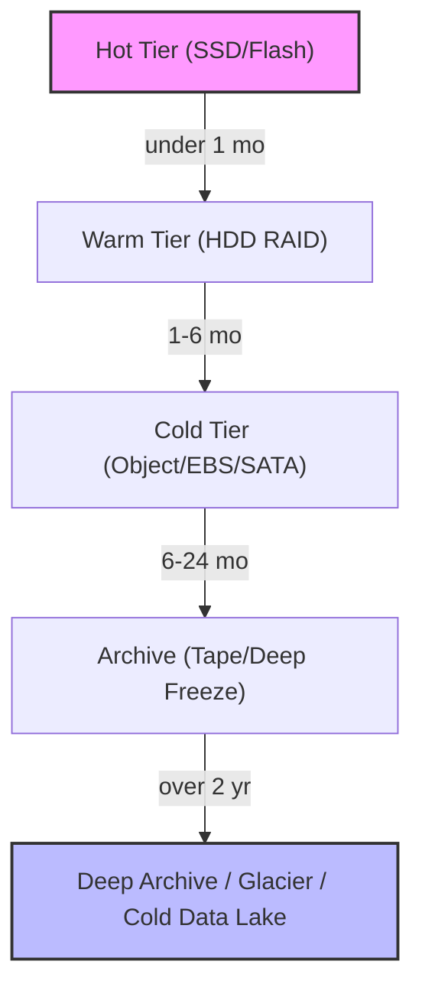
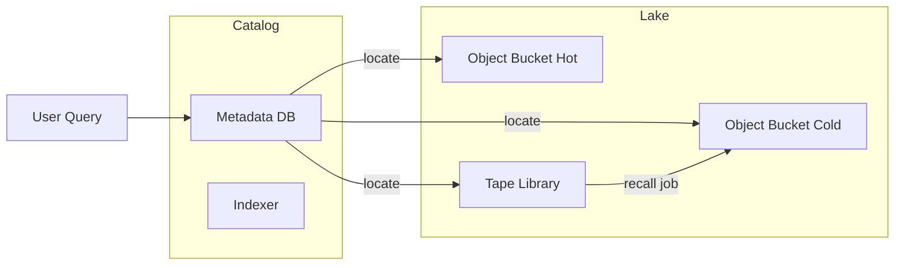
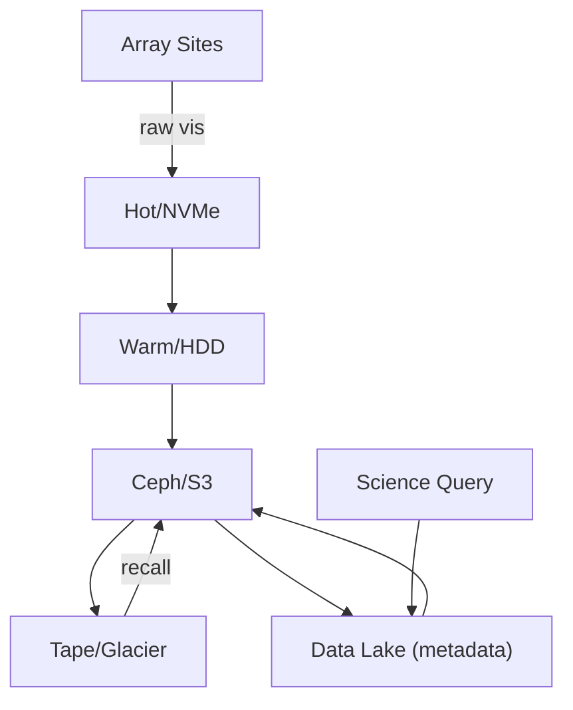

# Storage Strategy for 240 PB/year

To support the ngVLA-scale data volumes (~7.5‑8 GB/s, ~240 PB annually) over a 30‑year operational horizon, we need a multi‑tier, cost‑effective, searchable storage architecture.

## Objectives

- **Sustain ingest** of 240 PB/yr (≈ 20 TB/hr, 480 TB/day) from multiple sites.
- **Retain 30 years** of data (~7.2 EB total) with efficient access patterns.
- **Provide search & retrieval** even for decade‑old visibilities via metadata/DL solutions.
- **Minimize total cost of ownership (TCO)** using a mix of local and cloud resources.

## Tiered Storage Model

Real-time pipelines operate on Hot/Warm data; periodic reprocessing reads from Cold; legacy retrieval pulls from Archive/Deep tiers with scalable compute.

### Tier Details

1. **Hot Tier** – NVMe SSDs colocated with ingest services for <1‑month buffering and low-latency queries (<10 ms).  Assumed size: 5 PB per site.
2. **Warm Tier** – Dense HDD server clusters (RAID/NVMe cache) holding 1‑6 month window (~30 PB/site). Used for serving recent reprocessing jobs.
3. **Cold Tier** – Object storage (Ceph, S3) or large SATA arrays; retains 6‑24 months (~120 PB/site). Data accessible via search indexes.
4. **Archive** – LTO/S3 Glacier Deep Archive style tape libraries or cold object buckets; cost‑optimized for infrequent (<1 yr) access. Automatic lifecycle transitions.
5. **Deep Archive / Data Lake** – Multi‑exabyte object pool with a catalog (Elastic, BigQuery) that indexes metadata/summaries. Old data can be recalled to cold tier on-demand.

## Cost Estimates (2026 prices)

| Provider | Storage Class | $/TB‑month | 240 PB/yr Cost |
|----------|--------------|------------|----------------|
| Local HDD cluster | disk shelf | ≈ $20 | $4.8M |
| Local Tape (LTO‑9) | tape| ≈ $3 | $720k |
| AWS S3 Standard | object | $23 | $5.5M |
| AWS Glacier DA | archive | $1 | $240k |
| GCP Standard | object | $20 | $4.8M |
| GCP Coldline | archive | $1.3 | $312k |
| Azure Blob Hot | object | $22 | $5.3M |
| Azure Archive | archive | $1 | $240k |

*Note: cloud costs exclude egress/requests.  Multi‑cloud pricing negotiable.*

Local storage has higher capital expense but eliminates egress; tape offers lowest ongoing cost but slower retrieval (hours‑days).  Combined model uses local disk for hot/warm tiers and cloud/archive for cold/deep archive.

## Data Lake & Search

- Maintain a **metadata catalog** in BigQuery/Elastic or a graph database.
- Each visibility file is tagged with observation time, array config, frequency, source target, processing level.
- **Partitioned indices** allow sub‑second search across 7 PB indexes even if underlying data sits on tape.

Automated *recall jobs* ship requested chunks back to cold tier; compute can be scheduled on incoming data.

## Deep Freeze & Durability

- **Parity‑checked tape** with off‑site replication every quarter.
- Data integrity verified via checksums during lifecycle transitions.
- **Immutable buckets** and Write‑Once‑Read‑Many (WORM) for compliance.

## High‑Level Diagram

## Recommendations

1. **Hybrid approach** – local disk/tape for first 2 years, cloud archive for long‑term retention.
2. **Metadata heavy** – invest early in catalog service to enable fast access to old data.
3. **Cost tracking** – monitor TB‑day metrics; shift older data automatically to cheaper tiers.
4. **Explore new tech** – shingled magnetic recording (SMR) drives, cold NVMe, or DNA storage for 2030+.

This plan gives a roadmap for storing 240 PB/year while keeping the entire 30‑year history searchable and accessible within reasonable budgets.
