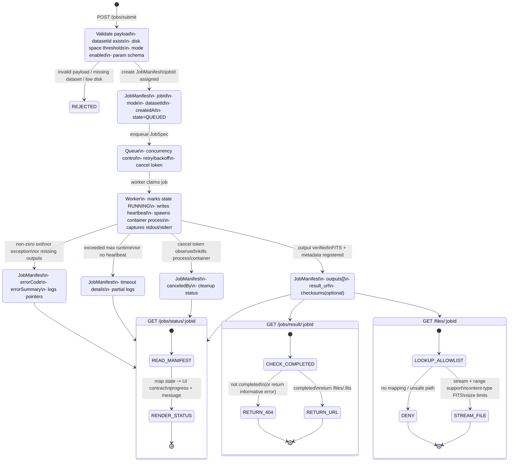

# Reference Architecture Diagram

Below is a detailed, verbose architecture diagram capturing the key
components discussed throughout the real‑data jobs idea documents.  It
illustrates the compute gateway pattern, the asynchronous queue, the
adapter abstraction, and the ancillary services (Redis, Postgres, Kafka,
metrics, etc.).  The diagram is intentionally complex to highlight all
moving parts and their responsibilities; consider it a conversation piece
for architecture reviews or hiring panels.

```mermaid
flowchart LR
  %% nodes
  subgraph Frontend["Frontend (Angular - NgRx)"]
    F1(Submit form)
    F2(Dataset selector)
    F3(Job list & cancel)
    F4(Metrics panel)
  end

  subgraph API [API (NestJS)]
    A1[JobsController]
    A2[TaccIntegrationService]
    A3[DatasetController]
    A4[JobRepository<br>(Postgres)]
    A5[EventsModule / Kafka]
    A6[Redis cache / queue]
    A7[Metrics endpoint]
  end

  subgraph Adapters [Adapter layer]
    D1(DemoAdapter)
    D2(LocalLLMAdapter)
    D3(CasaAdapter)
  end

  subgraph Queue [Asynchronous queue]
    Q1[Redis list / stream]
  end

  subgraph Worker [Worker container]
    W1[Job runner process]
    W2[Docker run --rm CASA]
    W3[Retry & backoff logic]
    W4[Prometheus metrics]
  end

  subgraph Storage [Result Storage]
    S1[/data/results/*.fits]
    S2[Postgres job history]
  end

  subgraph External [External services]
    X1[Kafka/RabbitMQ]:::external
    X2[TACC/Slurm/Cloud]:::external
  end

  %% flows
  F1 -->|POST /jobs/submit| A1
  F2 --> F1
  F3 -->|DELETE /jobs/:id| A1
  F4 -->|GET /metrics| A1

  A1 --> A2
  A2 --> A3
  A2 -->|writes| A4
  A2 -->|enqueue| Q1
  A2 -->|emit event| A5
  A2 -->|GET /datasets| A3

  A2 --> D1
  A2 --> D2
  A2 --> D3

  Q1 --> W1
  W1 --> W2
  W1 --> W3
  W1 -->|update status| A4
  W1 -->|update status| Q1
  W1 -->|write output| S1
  W1 --> W4

  D3 -->|access MS| S1
  D3 -->|store metadata| A4

  A5 --> X1
  A4 --> X1
  A2 --> X2

  classDef external fill:#f9f,stroke:#333,stroke-width:1px;

  %% notes
  click A2 "documentation/ideas/jobs-real-data/backend-adapter-design.md" "Adapter design" 
  click D3 "documentation/ideas/jobs-real-data/backend-adapter-design.md" "CASA adapter notes"
  click Q1 "documentation/ideas/jobs-real-data/phases-and-steps.md" "Queue phase"
  click F2 "documentation/ideas/jobs-real-data/frontend-enhancements.md" "Dataset UI"
```

---

## Job Lifecycle State Machine

The following state diagram provides a deep dive into the canonical job
state machine implemented by the `JobManifestService` and exercised by the
API & worker.  It documents every transition, the conditions that trigger
it, and the behaviour of the status/result/files endpoints.


