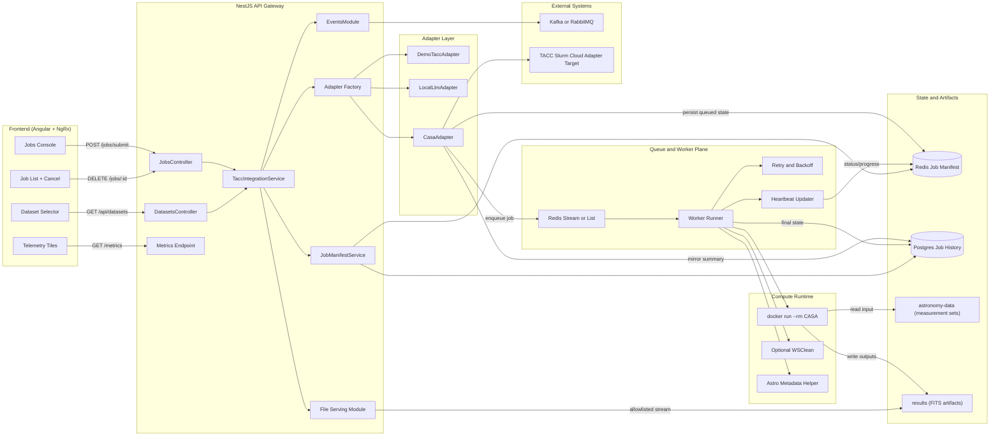
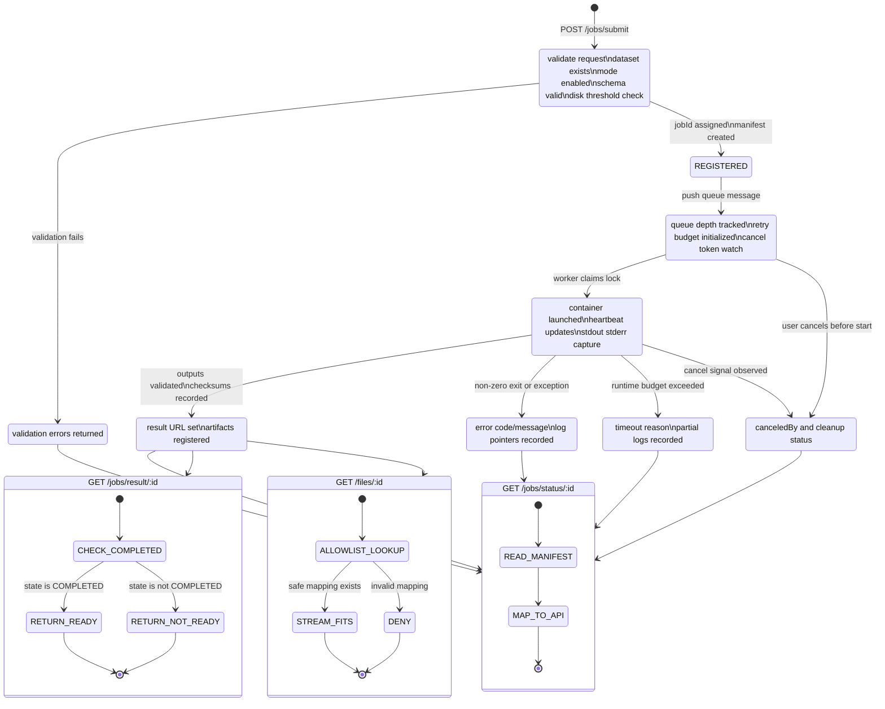
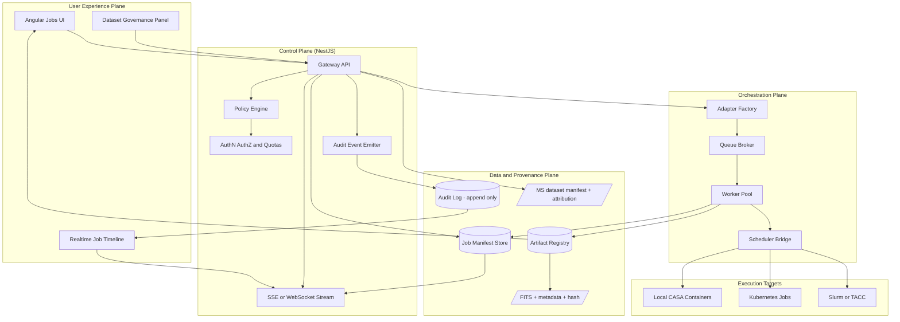

# Cosmic Horizon Real-Data Jobs Architecture

This document integrates the real-data jobs architecture into one reference
view for `documentation/ideas/jobs-real-data/`. It combines the gateway
topology, the job lifecycle state machine, and an HPC-grade control-plane
overlay that introduces policy, auditability, and streaming updates.

## Scope and Intent

- This is a **reference architecture prototype**, not production.
- The design keeps the existing NestJS + Angular stack and `TaccAdapter` contract.
- It supports mode-based backends (`demo`, `local-llm`, `astronomy`) without UI rewrites.
- It prioritizes async orchestration, persistent state, and safe artifact serving.

## Diagram 1: End-to-End Compute Gateway

This view shows runtime components and data/control flows across frontend,
API, adapters, queue/worker, storage, and external systems.

## Diagram 2: Job Lifecycle and Endpoint Behavior

This state machine defines deterministic transitions for status, timeout,
failure, cancellation, and result/file endpoint behavior.

## Diagram 3: HPC-Grade Control Plane Overlay

This overlay adds the extra control-plane components needed for stronger
operational parity with HPC gateway patterns: policy enforcement, audit log,
streaming job updates, and artifact registry/provenance.

## Implementation Notes

- Avoid synchronous `docker exec` in API request flow; use queue + worker.
- Treat job manifest as source-of-truth for status, progress, and errors.
- Keep artifact serving allowlisted to mapped outputs only.
- Keep dataset attribution metadata alongside manifest records.
- Keep CI paths lightweight by default; gate heavy astronomy tests behind opt-in flags.
