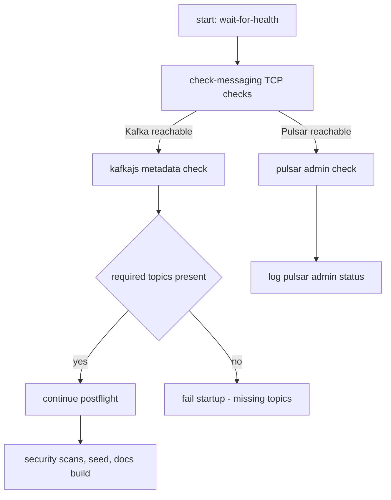

# Messaging Checks

This document describes the lightweight messaging checks executed by `scripts/check-messaging.mjs` and how they integrate into the `start:postflight` startup flow.

**What the checker does**

- TCP reachability checks for Kafka (default `127.0.0.1:9092`) and Pulsar (default `127.0.0.1:6650`).
- If `kafkajs` is available (installed via `npm install`), the script will query Kafka metadata and list topics.
- The script enforces a set of required Kafka topics by default; the list can be customized with the environment variable `REQUIRED_KAFKA_TOPICS` (comma-separated).
- If Pulsar admin is reachable and `node-fetch` is available, it will query the Pulsar admin REST endpoint for clusters.

**Default required Kafka topics**

- `job-metrics`
- `job-lifecycle`
- `audit-trail`
- `system-health`

Set custom required topics (comma-separated):

```bash
export REQUIRED_KAFKA_TOPICS=topic1,topic2,topic3
```

**Exit codes**

- `0` — checks passed (messaging reachable and required topics present when possible)
- `1` — neither Kafka nor Pulsar reachable
- `2` — required Kafka topics missing (enforced only when `kafkajs` is available)

**Flow diagram**



**Integration**

`start:postflight` runs `node scripts/wait-for-health.mjs` then `pnpm run check:messaging` before running security checks and seeding/docs build. This ensures that messaging systems are available and the expected topics are present before post-start checks proceed.

**Notes**

- The checker is intentionally lightweight and provides clear warnings; for stricter enforcement, configure the required topics and enable CI checks.
- If you need schema validation for Pulsar topics or Kafka Avro schema registry checks, provide the expected topic list or Schema Registry URL and I can add deeper checks.
